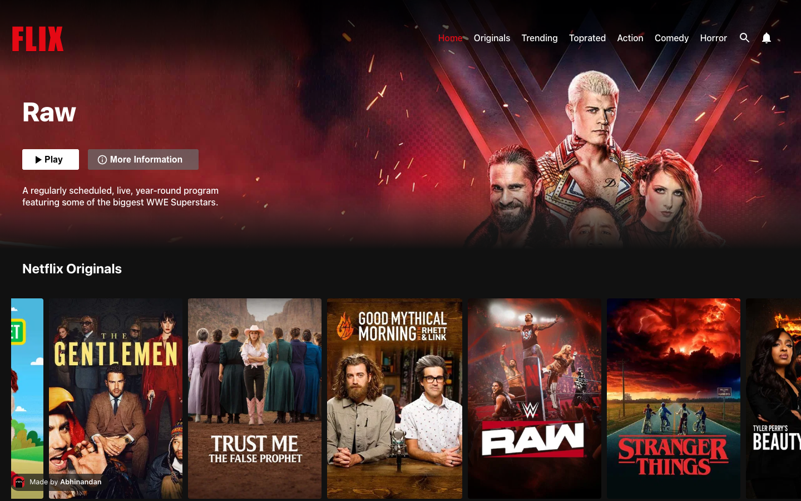
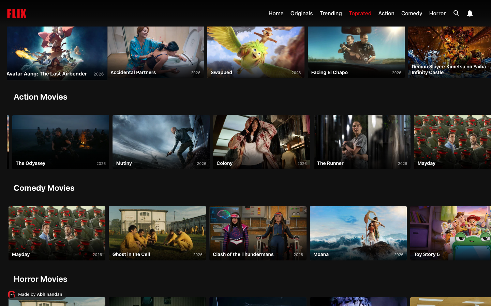
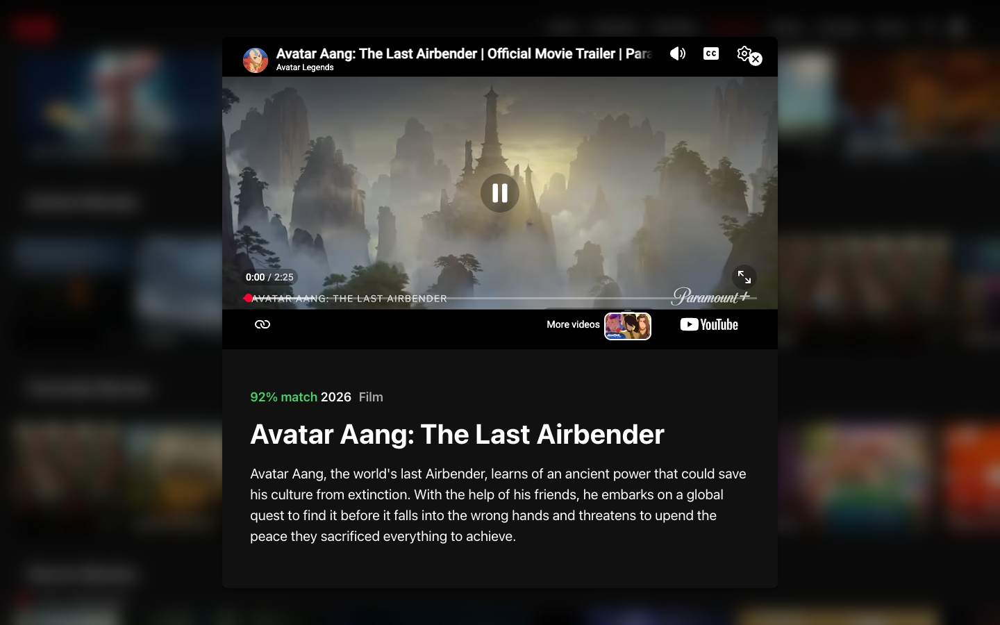

**Live:** https://abhinandansharma.github.io/netflix-clone/

# 🎬 Flix (a Netflix-style browser in React)

A responsive, Netflix-style browser built with React and the TMDB API: a featured banner, rows of titles that auto-scroll and pause on hover, captions with title and year on every card, and a modal that plays the trailer.







### 🔗 Live Preview  
**🌐 [View Live Demo](https://abhinandansharma.github.io/netflix-clone/)**

---

## 🚀 Features

- 🔄 Auto-scrolling horizontal movie rows (pause on hover)
- 🎞 Movie modals with details and trailer (YouTube embedded)
- 📺 Banner section with featured movie
- 📱 Fully responsive design (mobile-first)
- 🔍 Dynamic rows fetched from an API
- 🌓 Dark-themed Netflix-like styling
- 📂 Clean folder structure with separation of concerns

---

## 🌐 Data

Data comes straight from the [TMDB API](https://developer.themoviedb.org/). The key is injected at build time from the `TMDB_API_KEY` repository secret (see `.env.example` for local development), and a bundled snapshot in `src/API/fallback.json` keeps the UI working if the API is unreachable.

---

## 🛠 Tech Stack

- **Frontend:** ReactJS, JavaScript (ES6), CSS
- **HTTP Requests:** Axios
- **Icons & UI:** Material-UI, Custom CSS
- **Media Embeds:** YouTube IFrame Player API
- **Deployment:** Vercel

---

## 📁 Project Structure
```plaintext
src/
├── API/
│   ├── axios.js         # Axios instance
│   └── requests.js      # TMDB endpoints
├── movieModal/
│   └── MovieModal.js    # Movie detail modal with trailer
├── components/
│   ├── Banner.js
│   ├── Nav.js
│   └── Row.js
├── App.js
├── App.css
└── index.js
---
```

## ⚙️ Getting Started

### 1. Clone the repo

- ```git clone https://github.com/YOUR_USERNAME/netflix-clone.git```
- ```cd netflix-clone```


### 2. Install dependencies
```npm install```

### 3. Run locally
```npm start```

#### App will start at ```http://localhost:3000```

## 🧪 Available Scripts
- ```npm start```       - Starts the dev server
- ```npm test```       - Launches test runner
- ```npm run build```  - Builds for production

## 🤝 Contributing

Pull requests are welcome! If you’d like to improve UI, fix bugs, or add new features, feel free to fork and submit a PR.


## 📄 License

This project is open-source under the MIT license.


### Built with ❤️ by Abhinandan Sharma

Let me know if you'd like to add GitHub repo badges or a short walkthrough video/gif preview.

## Configuration

Create `.env` from `.env.example` with your TMDB API key. The GitHub Pages build reads it from the `TMDB_API_KEY` repository secret.


## Reliability

The app calls `api.tmdb.org` first (an official TMDB alias that stays reachable on networks where `api.themoviedb.org` is blocked) and falls back to the main host. If neither responds, rows render from a small bundled snapshot in `src/API/fallback.json` and show an "offline snapshot" badge.
